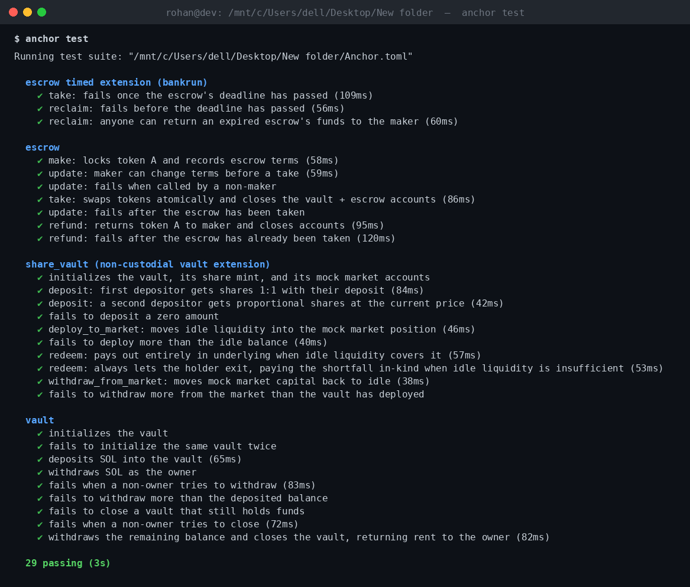

# Q3_26Builder_week2-rohan911438

Turbine Cohort Week 2 homework: three Anchor programs —
- a custodial SOL **Vault** (`programs/vault`),
- an SPL-token **Escrow** with a timed-escrow extension (`programs/escrow`), and
- a non-custodial, share-token **Vault extension** with in-kind redemption (`programs/share_vault`) —

all with full TypeScript test coverage.

- Anchor `1.1.2` / Solana CLI `3.1.10` / Rust `1.89.0` toolchain (workspace-pinned via
  `rust-toolchain.toml`).
- Tests use Anchor's TS harness (Mocha + `ts-mocha` + `@coral-xyz/anchor` + `@solana/web3.js` +
  `@solana/spl-token`) against a local `solana-test-validator`, plus `solana-bankrun` for the one
  test file that needs deterministic clock-warping (see the timed-escrow section for why).

## Build & test

```bash
npm install
anchor build
anchor test
```

`anchor test` builds all three programs, boots a local validator, and runs every file under
`tests/`: `vault.ts`, `escrow.ts`, and `share_vault.ts` against that local validator, plus
`escrow-timed.ts` against an in-process `solana-bankrun` runtime (29 tests total, happy path + at
least one failure case per instruction across all three programs and the timed-escrow extension).

**All tests passing:** 

(`docs/tests-passing.png` is a rendered image of the actual captured `anchor test` output from a
real run in this environment — not an OS-level screen capture, since this session has no display —
but every line in it is the genuine terminal text, unedited beyond stripping validator debug-log
noise.)

---

## Vault program

A single-owner custodial SOL vault: one owner deposits and withdraws their own SOL through a
program-owned PDA, with an explicit close step that refuses to sweep undrained funds.

### Accounts / PDAs

```
                         seeds: ["vault", owner]
   owner (signer) ────────────────────────────► Vault (state PDA)
                                                   owner, bump, vault_bump,
                                                   total_deposited, locked

                         seeds: ["vault", owner, "vault_authority"]
   owner ─────────────────────────────────────► vault_authority (system-owned PDA)
                                                   holds the actual lamports;
                                                   never deserialized as typed data
```

The `Vault` state account and the `vault_authority` lamport-holding PDA are derived
independently from the same owner so the state account's rent-exempt balance is never mixed
with user funds — `total_deposited` (in `Vault`) is the accounting source of truth, and
`vault_authority`'s lamport balance should always equal it.

### Instructions

| Instruction | Accounts | Description |
|---|---|---|
| `initialize` | `owner` (signer, mut), `vault` (init), `vault_authority`, `system_program` | Creates the `Vault` state PDA for `owner`. |
| `deposit(amount)` | `owner` (signer, mut), `vault` (mut), `vault_authority` (mut), `system_program` | Transfers `amount` lamports from the owner into `vault_authority`; increments `total_deposited`. |
| `withdraw(amount)` | `owner` (signer, mut), `vault` (mut), `vault_authority` (mut), `system_program` | Transfers `amount` lamports back to the owner via a PDA-signed CPI; decrements `total_deposited`. |
| `close` | `owner` (signer, mut), `vault` (mut, closed), `vault_authority` | Closes the `Vault` state account and returns its rent to the owner. |

**Design decisions:**
- **Deposits and withdrawals are owner-only** (not a pooled/multi-depositor vault) — this is a
  personal custodial vault, not a shared pool, so there's no need for share accounting.
- **`close` refuses to run while `total_deposited > 0`** (`VaultError::VaultNotEmpty`) rather than
  silently sweeping remaining funds to the owner on close. This is deliberate: an explicit
  `withdraw` before `close` means the owner always sees exactly how much they withdrew in its own
  transaction, instead of a close instruction silently moving an unbounded amount of SOL.
- `locked: bool` is reserved on `Vault` for future extensions (e.g. timed locks) but unused by the
  core instructions.

### Errors

| Error | Condition |
|---|---|
| `Unauthorized` | Signer does not match `vault.owner`. |
| `InsufficientFunds` | `withdraw` amount exceeds `vault.total_deposited`. |
| `VaultNotEmpty` | `close` called while `vault.total_deposited > 0`. |
| `InvalidAmount` | `deposit`/`withdraw` called with `amount == 0` (or an overflowing deposit). |

---

## Escrow program

A classic SPL-token escrow: a maker locks token A in a program-owned vault and names a price in
token B; a taker can atomically pay that price and claim the vaulted token A, or the maker can
refund/update the offer before that happens.

### Accounts / PDAs

```
                    seeds: ["escrow", maker, seed]
  maker (signer) ─────────────────────────────► Escrow (state PDA)
                                                    seed, maker, mint_a, mint_b,
                                                    receive_amount, deadline, bump
                                                        │
                                                        │ associated_token::authority
                                                        ▼
                                                  vault (ATA, mint = mint_a)
                                                    holds the maker's deposited token A
```

`seed` lets one maker run multiple concurrent escrows. Client calls to `take`/`refund`/`update`
pass `seed` back in as an instruction argument so the PDA can be re-derived and validated without
the program needing to trust a client-supplied escrow address.

### Instructions

| Instruction | Accounts | Description |
|---|---|---|
| `make(seed, deposit_amount, receive_amount, deadline_duration)` | `maker` (signer, mut), `mint_a`, `mint_b`, `maker_ata_a` (mut), `escrow` (init), `vault` (init, ATA), `token_program`, `associated_token_program`, `system_program` | Creates the escrow PDA and vault ATA, moves `deposit_amount` of token A from the maker into the vault via `transfer_checked`, and stamps `deadline = now + deadline_duration`. |
| `take(seed)` | `taker` (signer, mut), `maker` (mut), `mint_a`, `mint_b`, `taker_ata_b` (mut), `taker_ata_a` (init-if-needed), `maker_ata_b` (init-if-needed), `escrow` (mut, closed), `vault` (mut), `token_program`, `associated_token_program`, `system_program` | Taker pays `receive_amount` of token B to the maker, then the escrow PDA releases the vaulted token A to the taker; closes the vault ATA and the escrow account, rent returned to the maker. Fails with `EscrowExpired` once `deadline` has passed. |
| `refund(seed)` | `maker` (signer, mut), `mint_a`, `maker_ata_a` (mut), `escrow` (mut, closed), `vault` (mut), `token_program`, `system_program` | Maker cancels at any time (before or after the deadline): returns the vaulted token A to the maker and closes the vault ATA + escrow account. |
| `update(seed, mint_b, receive_amount)` | `maker` (signer), `escrow` (mut) | Maker changes the asked-for mint/amount on an escrow that has not yet been taken. |
| `reclaim(seed)` | `caller` (signer, mut), `maker` (mut), `mint_a`, `maker_ata_a` (mut), `escrow` (mut, closed), `vault` (mut), `token_program`, `system_program` | **Timed extension.** Permissionless equivalent of `refund`, callable by anyone once `deadline` has passed — funds still land in the maker's own ATA regardless of who signs. Fails with `EscrowNotExpired` before the deadline. |

**Design decisions:**
- **`take`/`refund` close the escrow account**, so `update` (and a second `take`/`refund`) after
  either of those naturally fails — there's no separate "already taken" flag to maintain; the
  account simply no longer exists, which surfaces as an Anchor account-resolution error in tests.
- **Amounts are read from the vault's live token balance** (`vault.amount`) at `take`/`refund`
  time rather than duplicated into `Escrow` state, so there is exactly one source of truth for how
  much token A is owed.
- `take`'s `taker_ata_a` and `maker_ata_b` use `init_if_needed` so a first-time taker/maker pair
  doesn't need to pre-create associated token accounts.
- Several `Account<'info, T>` fields in `TakeEscrow` are wrapped in `Box<...>` — with 12 accounts
  in that context, the generated `try_accounts` stack frame exceeded Solana BPF's 4KB per-frame
  limit; boxing moves the deserialized account structs to the heap.

### Errors

| Error | Condition |
|---|---|
| `InvalidAmount` | `make` called with `deposit_amount == 0`, `receive_amount == 0`, or `deadline_duration <= 0`; or `update` with `receive_amount == 0`. |
| `Unauthorized` | Signer does not match `escrow.maker` (checked on `take`, `refund`, `update`, `reclaim`). |
| `EscrowExpired` | `take` called after `escrow.deadline` has passed. |
| `EscrowNotExpired` | `reclaim` called before `escrow.deadline` has passed. |

### Timed extension: expiry & reclaim policy

`make` now takes a `deadline_duration` (seconds) and stores `deadline = Clock::get()?.unix_timestamp
+ deadline_duration` on the `Escrow` account.

The assignment offered two policy choices for how expiry interacts with cancellation; this
implementation picks the second one explicitly:
- `take` is blocked once `deadline` passes (`EscrowExpired`).
- `refund` is **left unrestricted** — the maker can still cancel at any time, before or after the
  deadline. There's no reason to force a maker to wait out their own expired offer.
- A new **`reclaim`** instruction is added: identical effect to `refund`, but callable by *anyone*
  once the deadline has passed (`EscrowNotExpired` if called too early). This lets a third party —
  a keeper, a crank, or just a helpful bystander — clean up an abandoned escrow and return funds to
  the maker without needing the maker's signature or attention.

**Why a separate `escrow-timed.ts` test file, and why bankrun instead of the local validator:**
`solana-test-validator`'s Clock sysvar only advances in step with real wall-clock time, and on
this environment's setup (WSL, project directory on a `/mnt/c` Windows-drive mount) it was
observed to *stall* for 90+ seconds under disk-I/O pressure rather than track wall time — see the
git history for the debugging trail. Blindly `sleep()`-ing a fixed duration and hoping the
on-chain clock kept pace made these tests flaky. `tests/escrow-timed.ts` instead boots the escrow
program under `solana-bankrun` (via `startAnchor`) and uses `context.setClock(...)` to warp the
on-chain clock forward instantly and deterministically — exactly the tool the original assignment
pointed to for this situation. `tests/vault.ts` and `tests/escrow.ts` still use the local-validator
harness for everything else, since that flakiness only shows up when a test needs to wait out a
real time interval.

---

## Non-custodial vault extension (`share_vault` program)

The advanced stretch goal — deposits mint a proportional share token, and redemption is always
available even under low idle liquidity — assumes **multiple depositors pooling into one vault**,
which is a fundamentally different model from the single-owner custodial `vault` program above.
Rather than bolt pooled-share semantics onto a program designed around one owner, this is a
**separate third program**, `programs/share_vault`, so neither design has to compromise for the
other. It is genuinely a from-scratch vault, not a variant of the custodial one.

### Accounts / PDAs

```
                              seeds: [b"share_vault", underlying_mint]
                        ┌───────────────────────────────► ShareVault (state PDA)
                        │                                    underlying_mint, share_mint,
                        │                                    market_mint, bumps
 underlying_mint ───────┤
                        │   seeds: [.., b"authority"]
                        └───────────────────────────────► vault_authority (signer-only PDA)
                                                              mint authority for share_mint
                                                              & market_mint; owns every ATA
                                                              below
              ┌──────────────────┬──────────────────┬──────────────────┬────────────────────┐
              ▼                  ▼                   ▼                  ▼                    ▼
        share_mint          market_mint        idle_underlying    market_custody       market_position
    seeds: [..,"share_    seeds: [..,"market_   seeds: [..,"idle"]  seeds: [..,        (ATA, mint =
    mint"], PDA mint       mint"], PDA mint      token account,     "market_custody"]   market_mint,
                           (mock receipt)        mint=underlying    token account,      authority =
                                                                     mint=underlying     vault_authority)
```

`idle_underlying` and `market_custody` both hold the *underlying* mint but must be independent
token accounts (an Associated Token Account address is uniquely determined by `(owner, mint)`, and
both are owned by `vault_authority`) — so both are created as plain `token::` accounts at explicit
PDA seeds rather than as ATAs.

### Instructions

| Instruction | Description |
|---|---|
| `initialize_vault` | One-time setup per underlying mint: creates the `ShareVault` state, the `share_mint` and `market_mint` PDAs, and the `idle_underlying` / `market_custody` / `market_position` token accounts. |
| `deposit(amount)` | Moves `amount` of the underlying token from the depositor into `idle_underlying`, then mints shares pro-rata to the vault's current total value (idle + deployed). The very first deposit sets the initial 1:1 share price. |
| `redeem(shares)` | Burns `shares` and pays out the pro-rata entitlement — from `idle_underlying` first; **any shortfall is paid in-kind as `market_mint` receipt tokens** rather than blocking the redemption. See below. |
| `deploy_to_market(amount)` | Permissionless: moves `amount` of underlying from `idle_underlying` to `market_custody` and mints `amount` of `market_mint` into `market_position` — the mock stand-in for depositing into an external lending/market protocol. |
| `withdraw_from_market(amount)` | Permissionless: the reverse — burns `market_mint` from `market_position` and moves underlying back from `market_custody` to `idle_underlying`. |

### Design decisions & trade-offs

- **The mock market is a second SPL mint, not a second program.** `market_mint` is pegged 1:1 to
  the underlying by construction (deploying and withdrawing always move both sides together by the
  same amount), so it carries no yield or price risk of its own in this MVP — it exists purely to
  give "deployed capital" a concrete, transferable token identity, per the assignment's suggestion
  to scaffold a simplified stand-in rather than integrate a real external protocol.
- **Share price formula is the standard ERC-4626-style ratio**: `shares = amount * supply /
  total_value` (first deposit is 1:1 since `total_value == 0`). `total_value = idle_underlying.amount
  + market_position.amount`, i.e. deployed capital counts at its 1:1-pegged face value.
- **The core guarantee — no admin gate, no lockup, exit always available — is enforced entirely by
  `redeem`'s payout logic**, not by restricting `deploy_to_market`: a holder's entitlement is always
  computable and always payable in *some* combination of `idle_underlying` (real underlying) and
  `market_mint` (a receipt/claim), because those two balances are exactly what backs the share
  supply. There is no code path where `redeem` can return an error because liquidity is low — only
  because the caller passed bad input (`InvalidAmount`) or the vault is genuinely empty
  (`EmptyVault`).
- **In-kind payouts hand the user a claim, not cash.** In a real integration `market_mint` would be
  redeemable through the actual external protocol; here it's intentionally left as a mock receipt
  the user holds, which is honest about the scope of the simulation rather than pretending the
  in-kind portion is immediately liquid.
- **`deploy_to_market`/`withdraw_from_market` are permissionless** because they only ever move the
  vault's own funds between its own accounts, 1:1 — there's nothing for an arbitrary caller to
  steal or grief by invoking them, so gating them behind an authority would add complexity without
  adding safety.
- **Known limitation:** integer division in the share/entitlement formulas rounds down, so very
  small deposits/redemptions relative to the pool can round to zero shares or zero payout
  (`InvalidAmount`). This is the standard dust-rounding trade-off in share-based vaults and is
  considered acceptable for this scope.

### Errors

| Error | Condition |
|---|---|
| `InvalidAmount` | `deposit`/`redeem`/`deploy_to_market`/`withdraw_from_market` called with a zero amount, or a computed shares/entitlement amount rounds down to zero. |
| `MathOverflow` | A checked multiplication/cast in the share-price or entitlement formula overflowed. |
| `EmptyVault` | `redeem` called while the vault has zero shares outstanding or zero total value. |
| `InsufficientIdleLiquidity` | `deploy_to_market` amount exceeds `idle_underlying`'s balance. |
| `InsufficientMarketPosition` | `withdraw_from_market` amount exceeds `market_position`'s balance. |

Tested in `tests/share_vault.ts` against the local validator: initialize, first/second deposit at
the correct share price, a zero-amount deposit failure, deploying to the mock market, an
over-deploy failure, a redemption fully covered by idle liquidity, **a redemption where idle
liquidity is insufficient and the shortfall is paid in-kind as `market_mint`** (the core guarantee
this extension exists to demonstrate), withdrawing from the market, and an over-withdraw failure.

---

## What's implemented vs. not

- [x] Vault: `initialize`, `deposit`, `withdraw`, `close` — implemented and tested.
- [x] Escrow: `make`, `take`, `refund`, `update` — implemented and tested.
- [x] Full test suite passing (`anchor test`, 29/29).
- [x] Timed escrow extension (deadline, `EscrowExpired`/`EscrowNotExpired`, permissionless `reclaim`) — implemented and tested via bankrun clock-warping.
- [x] Non-custodial share-token vault extension (`share_vault` program: `initialize_vault`, `deposit`, `redeem`, `deploy_to_market`, `withdraw_from_market`, including in-kind redemption under low liquidity) — implemented and tested.
